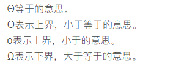

# 算法分析

### 数学表示



复杂度与时间效率的关系：
$$
c<log2n<n<nlog2n<n^2<n^3<2^n<n!
$$
如果没有特殊指定的话，我们要求的一般是最坏情况

### 运行时间计算

#### 一般法则

1. for循环运行时间为内部运行时间乘以迭代次数

2. 循环嵌套：该语句运行时间乘以for循环的大小的乘积

3. 顺序语句：求和

4. if/else: 运行时间加上判断分支运行长的时间

5. 递归： 通过递归方程进行计算

   example: 

   >   一般地，当递归方程为T(n) = aT(n/c) + O(n), T(n)的解为： 
   >
   >   O(n)          (a<c && c>1)   
   >
   >   O(nlog2n)     (a=c && c>1) //以2为底  
   >
   >   O(nlogca)     (a>c && c>1) //n的(logca)次方，以c为底

#### 对数

一般来说，如果一个算法使用O(1)的时间将一个问题拆成相等的两个问题，则其时间复杂度为O（logn）

**例子** ： **对分查找** O(logn)

```cpp
template<typename Comparable>
Comparable binarySearch(const std::vector<Comparable> &a, const Comparable &target){
    int low = 0, high = a.size()-1;
    while(low <= high){
        int mid = (high-low)/2;
        if(a[mid] == target) return mid;
        if(a[mid] > target){
            low=mid+1;
        }else{
            high=mid-1;
        }
    }
}
```

**欧几里得算法 **O(logn)

```cpp
long long gcd(long long m, long long n){
    while(n!=0){
        long long rem = m % n;
        m = n;
        n = rem;
    }
    return m;
}
```

