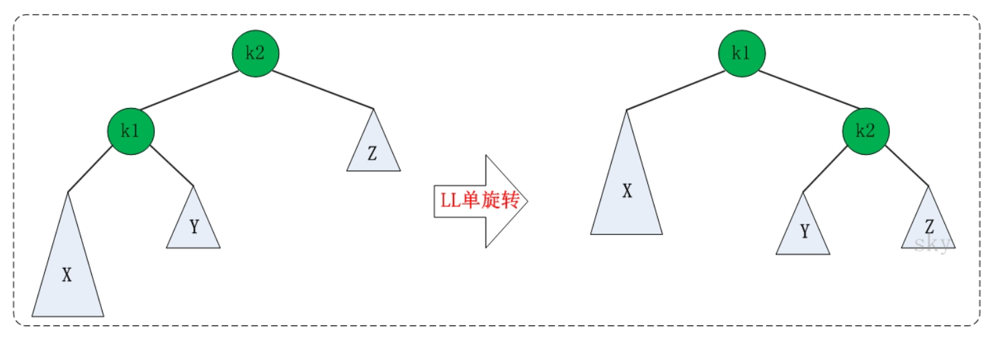
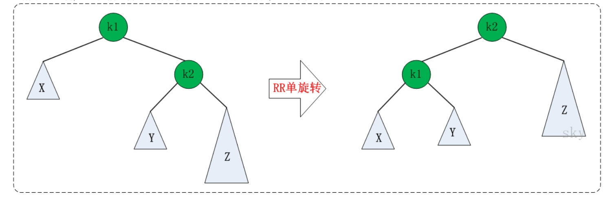
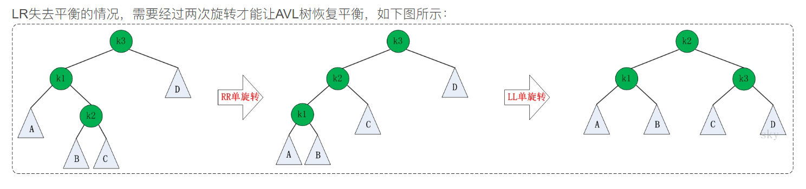
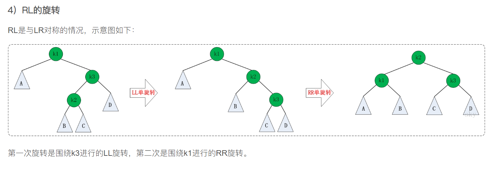

# AVL 树

带有平衡条件的二叉查找树

保证树的深度为O(logN)

一棵AVL树左右子树高度差最大为1

除了插入与删除，所有操作都可以保证O(logN)

### 不平衡

AVL 不平衡出现在四种情况中

- 插入左儿子的左子树
- 插入左儿子的右子树
- 插入右儿子的左子树
- 插入右儿子的右子树

1.4 2.3 为对称问题

### 单旋转（左-左 或 右-右）



**code**

```cpp
template<class T>
AVLTreeNode<T>* AVLTree<T>::leftLeftRotation(AVLTreeNode<T> *k2)
{
	AVLTreeNode<T> *k1;
	
	k1 = k2->left;
	k2->left = k1->right;
	k1->right = k2;
	
	k2->height = max(height(k2->left), height(k2->right)) + 1;
	k1->height = max(height(k1->left), k2->height) + 1;
	
	return k1;
}
```




**code**

```cpp

template<class T>
AVLTreeNode<T>* AVLTree<T>::rightRightRotation(AVLTreeNode<T> *k1)
{
	AVLTreeNode<T> *k2;
	
	k2 = k1->right;
	k1->right = k2->left;
	k2->left = k1;
	
	k1->height = max(height(k1->left), height(k1->right)) + 1;
	k2->height = max(k1->height, height(k2->right)) + 1;
	
	return k2; 
}
```

### 双旋转

#### LR



**code**

```cpp
template <class T>
AVLTreeNode<T>* AVLTree<T>::leftRightRotation(AVLTreeNode<T>* k3)
{
	k3->left = rightRightRotation(k3->left);
	
	return leftLeftRotation(k3);
}
```



**code**

```cpp
template <class T>
AVLTreeNode<T>* AVLTree<T>::rightLeftRotation(AVLTreeNode<T>* k1)
{
	k1->right = leftLeftRotation(k1->right);
	
	return rightRightRotation(k1);
}
```

